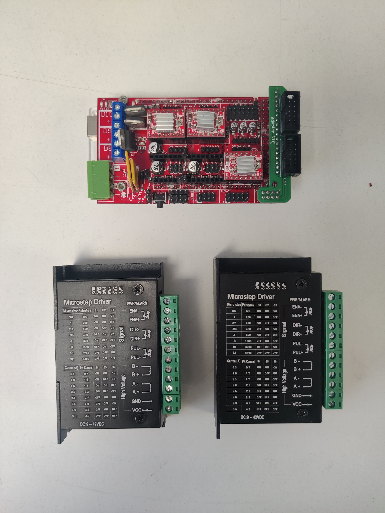
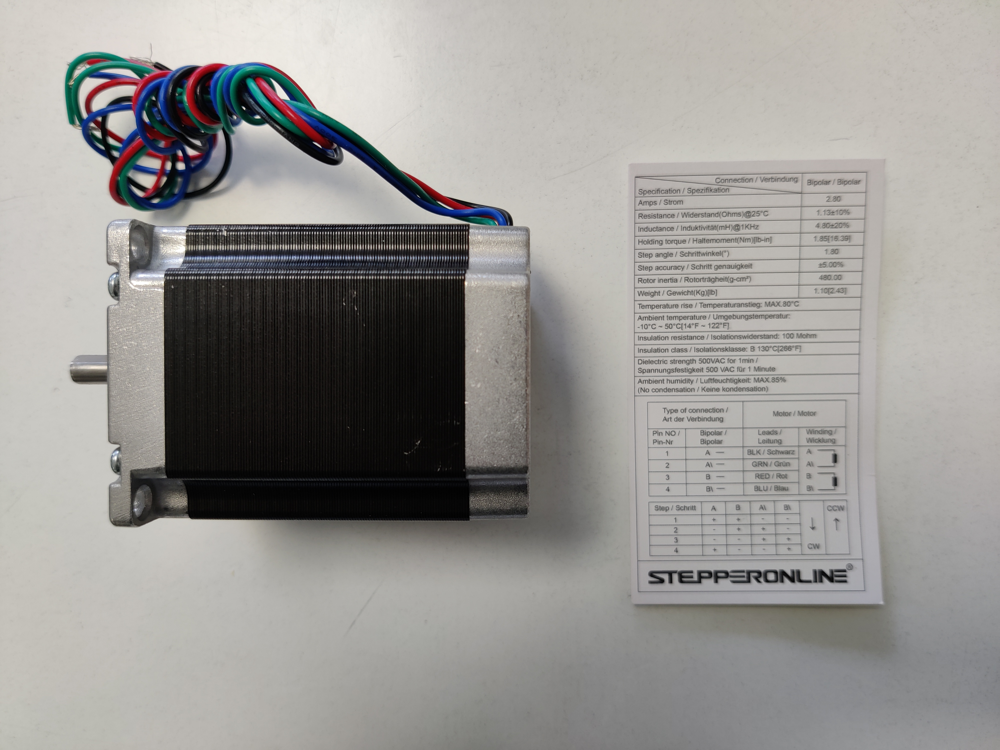

# Drafter

The drafting machine is intended for drafting (and doubling) sliver and roving to prepare it for spinning. We expect many add-ons and light modifications to support different fibre types.

## Tools
- M5 spanner
- Hex allen keys
- vice
- clamps
- bearing pusher (like for skateboards?)
- Screwdriver
- Crimping tool

## Parts

### Hardware
- 30x30 aluminium extrusion for frame
- angle brackets for fixing frame 
- 4 x 300mm threaded M8 rods
- 8 x 10-24 UNC 3 inch bolts (bolt diameter just under 4mm)
- 8 x M8 pillow blocks (42mm spacing between the fixing holes)
- 4 x M5x40mm nut and bolt (for fixing motor)
- 8 x M5x14mm bolt and t-nut (fixing motor mount and pillow mount to extrusion)
- 8 x M8 lock nut (for fixing driven roller and top roller)
- 2 x 6.35mm to 8mm motor coupling (check the shaft width on your motor - beware imperial vs metric!)
- 8 x 8mm bore bearing
- 8 x 3D printer bed levelling springs (to fit on 10-24 bolts, inside diameter > 4mm)

### Specialist Parts
- 2 x drafter cots

### 3D Models
- 2 x Stepper mount
- 2 x pillow block mount
- 2 x Drive wheel
- 4 x Trailing wheel for cot

### Electronics
- Arduino Mega
- RAMPS 1.4 Shield
- 2 x TB6600 Stepper Motor Driver
- 2 x NEMA 23 Stepper Motor
- 24V power supply
- 24V to 12V buck converter
- Electrical wire and crimps 
- Terminal blocks

*Arduino with RAMPS 1.4 shield and TB6600 stepper motor driver*

*Nema 23 Motor and wiring specification*

## Assembly
* Assemble the aluminium extrusion frame. The two long bars should be spaced 165mm apart. They must be stacked on two layers of extrusion (60mm high).
* Attach the stepper mount to extrusion.
* Screw driven roller on to threaded rod leaving 5cm clear at one end. Fasten in place on both sides using a lock nut.
* Sand down the trailing wheels for cot until you can push them into the drafter cot - it should be a (very) tight fit!
* Place a bearing in each trailing wheel and insert onto the rod (placement on the rod is not so important as it can be adjusted later). Place another bearing either side of the cot (acting as a spacer) and then fix in place with a lock nut. The cot should be able to rotate freely.
* Place 2 10-24 screws from the bottom up through the holes on the stepper mount, place a pillow block on top and fasten with nut (important to fasten after placing the pillow block otherwise the bores won't align).
* Stack the second pillow-block through the bolts on top of the first.
* Place a spring over each bolt and fix in place with a washer and nut.

* Repeat for all stepper and pillow block mounts.
* Attach the stepper mounts and pillow blocks to the extrusion bars. Fasten the stepper motor to the mount and attach the driven roller rod to the motor using the coupling.
* Time to wire up the motors to the arduino and to the power supply...

### Wiring

[WIRING DIAGRAM NEEDED]

* Wire 24V directly to TB6600 (Ground to GND, Live to VCC)
* Wire A+/A-/B+/B- directly to the motor (check the motor wiring specification, you can also identify the motor "coils" with a multimeter - find the pairs of the wires that form a circuit)
* Wire the remaining outputs as follows
** PUL+ to Arduino STEP
** PUL- to DIR-
** DIR+ to Arduino DIR
** DIR- to ENA-
** ENA+ to Arduino EN
** ENA - to Arduino GND

## Operation
Install the software on the Arduino and start drafting!
