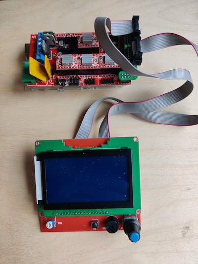
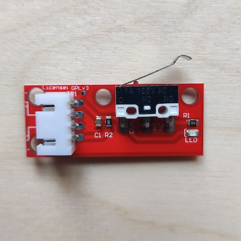
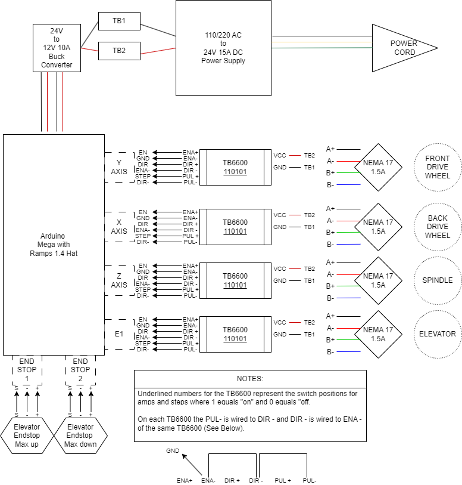

# Software
Alternative operating software for Studio Hilo's spinning machine. Open ```hilo_app/hilo_app.ino```
in the arduino IDE, upload the code to the arduino and you are ready to go!

## Smart Controller
This mod adds a Smart Controller for operating the Hilo directly without need for plugging in a computer.

The supported controller is the Reprap Smart Controller 12864 LCD Display for RAMPS 1.4. These are made 
by different manufacturers, however it's worth paying a bit more for one you feel will be well 
constructed. The controller comes ready to go and doesn't require any soldering.

.

The following [video](https://www.youtube.com/watch?v=_RJUcNNG9EE) shows how to attach the Smart Controller to the arduino RAMPS board
(only the beginning of the video is relevant).

Once up and running you can navigate through the different settings by turning the encoder dial. Press on the dial
to select a setting and then turn to change the value. Press again to set the value and return to the selection mode.
Start the machine by navigating to the Start menu item at the bottom and pressing the encoder dial. Stop the 
machine by pressing the encoder. Sometimes you might find the responsiveness of the dial is not perfect, this
is expected but should not present any useability issues.

## End Stops
This mod adds end stops to allow the elevator to travel up and down whilst spinning. In this way the spun yarn
is distributed over the length of the bobbin. 

You will need to order 2 Endstop limit switches with cables, compatible with the RAMPS 1.4 Arduino Mega shield.

.

The following [video](https://www.youtube.com/watch?v=r_nURQsNnwU) shows how to attach the end stops to the arduino
board (only the beginning of the video is relevant). Connect to the pins for the X MAX and X MIN end stops (it
doesn't actually matter which one is the top and which one the bottom of the elevator as either one will just
reverse the direction the elevator is moving in). You can attach the end stop stop switches to one of the metal 
guiding rods that the elevator moves along. When the elevator triggers the end stop its direction will be 
reversed.

## Improved Motor Drivers
The A4899 motor drivers used in the original HILO setup operate at the limit of their capacity. In order to obtain
better and more even drafting it is recommended to apply more pressure to the drafting wheels (for instance
by using clamps). This increased pressure puts more load on the motors and as a result they need more current
to operate correctly (around 2A). This can be achieved by replacing the A4899 driver with the TB6600. This
is an external driver that requires additional wiring. Here is a wiring diagram for them (we will provide more info and 
pictures of how to setup this alternative motor driver soon):

.

Happy spinning!

