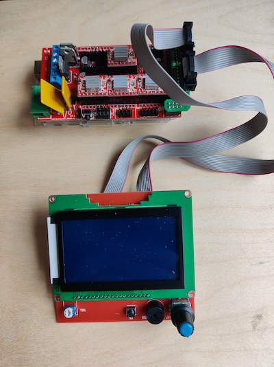

# Software
Alternative operating software for Studio Hilo's spinning machine. Open ```hilo_app/hilo_app.ino```
in the arduino IDE, upload the code to the arduino and you are ready to go!

## Smart Controller
This mod adds a Smart Controller for operating the Hilo directly without need for plugging in a computer.

The supported controller is the Reprap Smart Controller 12864 LCD Display for RAMPS 1.4. These are made 
by different manufacturers, however it's worth paying a bit more for one you feel will be well 
constructed. The controller comes ready to go and doesn't require any soldering.

.

The following [video](https://www.youtube.com/watch?v=_RJUcNNG9EE) shows how to attach the Smart Controller to the arduino RAMPS board
(only the beginning of the video is relevant).

Once up and running you can navigate through the different settings by turning the encoder dial. Press on the dial
to select a setting and then turn to change the value. Press again to set the value and return to the selection mode.
Start the machine by navigating to the Start menu item at the bottom and pressing the encoder dial. Stop the 
machine by pressing the encoder. Sometimes you might find the responsiveness of the dial is not perfect, this
is expected but should not present any useability issues.

Happy spinning!

